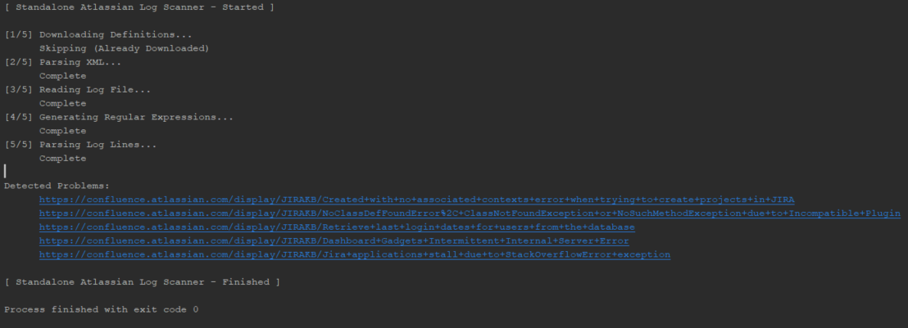

# Standalone Atlassian Log Scanner/Analyser

Sick of the time it takes to scan your Atlassian log files using the Log Analyser? Enter SALSA!
This is a standalone version of the Log Scanner (Hercules) that is built into Jira, Confluence, Bitbucket, Bamboo, Crowd and Fisheye/Crucible. 
The aim is to increase the speed of scanning dramatically compared to executing through the interface and allow automated scanning of log files in a support system.

## Performance
A 3MB Log File took the following duration:
* Support Tools Log Analyser: 6 minutes 14 seconds
* Standalone Log Scanner (sequential): 1 minute 48 seconds
* Standalone Log Scanner (parrallel): 34 seconds

*That's an over 70% improvement when sequentially run and an over 90% improvement when run in parrallel*

## How it Works
The following steps are followed:
1. (if it doesn't already exist) Download the definition file from the Atlassian website, or a custom URL
2. Parses the XML into JAXB Objects
3. Generates Regular Expression List
4. Reads the Log File
5. Runs Regular Expressions on each Log Line (either sequentially or in parrallel)
6. Prints out the URL of all errors that have been found in the system (distinct)

## Compiling
Run the following command to build the project into a JAR file:

`mvn package`

## Usage
Execute the following on your command line (CMD or Bash) and leave the `-stream` parameter out if you would like it to run sequentially (which is much less demanding). To see all problems, use the `-verbose` flag

`java -jar log-scanner.jar -def=jira-core -log=atlassian-jira.log -stream`

## Custom Definitions
This tool supports custom definitions, by providing a URL as the definition argument:

`-def=https://www.example.com/definition.xml`

There is a sample definition file in the examples/ folder.

## Download
You can download a pre-compiled binary from the [releases page](https://github.com/jackgraves/standalone-atlassian-log-scanner/releases)

## Example
### Built-in Tool

### Standalone Tool

## Improvements
- [x] Use Parallel Streams API to speed up analysis
- [x] Implement flags and arguments
- [x] Show Datetime for each detected problem
- [ ] Show line number against each detected problem
- [ ] Implement multiple definitions per analysis (by combining XML)
- [ ] Implement Jira Service Desk App for use with support tickets
- [ ] Port to Node.js for use with NPM
