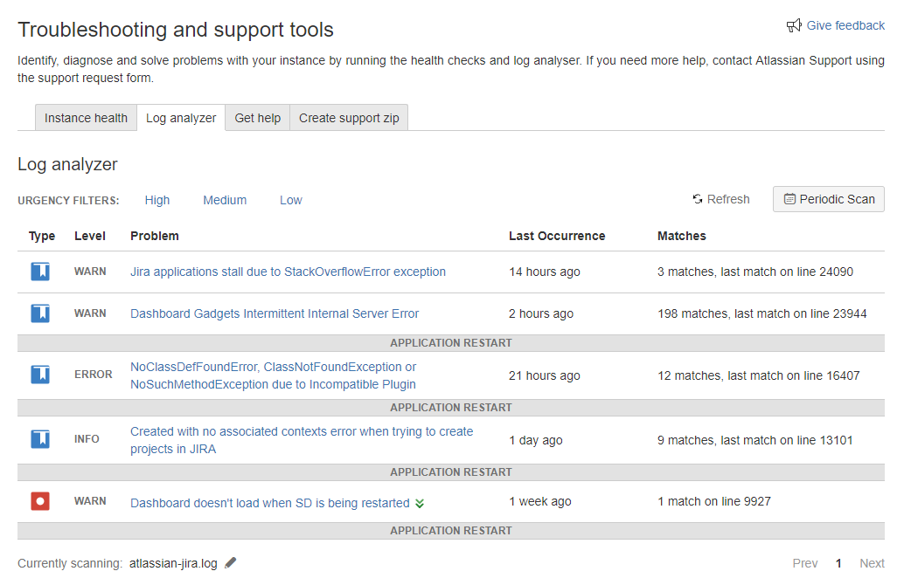

Sick of the time it takes to scan your Atlassian log files using the Log Analyser?
 Enter SALSA!
# Standalone Atlassian Log Scanner/Analyser
This is a standalone version of the Log Scanner (Hercules) that is built into Jira, Confluence, Bitbucket, Bamboo, Crowd and Fisheye/Crucible. 
The aim is to increase the speed of scanning dramatically compared to executing through the interface and allow automated scanning of log files in a support system.

## Performance
A 3MB Log File took the following duration:
* Support Tools Log Analyser: 6 minutes 14 seconds
* Standalong Log Scanner: 1 minute 48 seconds

*That's an over 70% improvement!*

## How it Works
The following steps are followed:
1. (if it doesn't already exist) Download the definition file from the Atlassian website
2. Parses the XML into JAXB Objects
3. Generates Regular Expression List
4. Reads the Log File
5. Runs Regular Expressions on each Log Line
6. Prints out the URL of all errors that have been found in the system (distinct)

## Compiling
Run the following command to build the project into a JAR file:
`mvn package`

## Usage
Execute the following on your command line (CMD or Bash):
`java -jar logscanner.jar "jira-core" "atlassian-jira.log"`

## Next Steps
- [ ] Use a Worker Pool to perform RegEx Matching in parrallel
- [ ] Write Jira plugin to automatically scan incoming support log files

## Example
The built-in log analyser results:

The same errors, shown in the SALSA tool:

